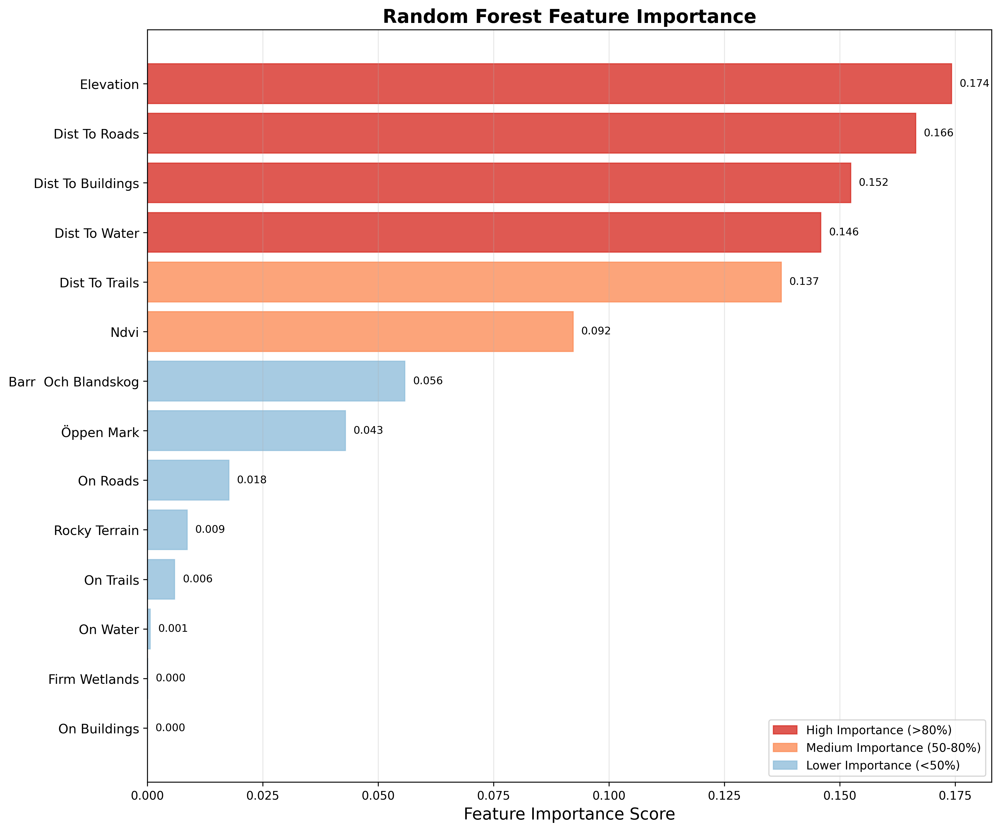
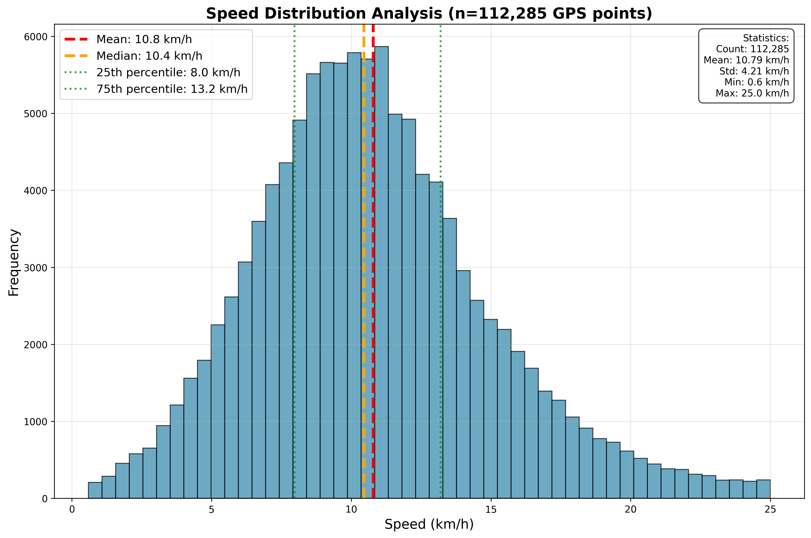

# From Forest to Finish: A Random Forest Approach to Orienteering Route Optimization

## Introduction/Overview

This project develops a comprehensive spatial analytics framework for optimizing orienteering routes using machine learning techniques. Orienteering is a challenging sport that requires athletes to navigate through complex terrain using only a map and compass, making optimal route selection critical for competitive success.

The core objective is to train a Random Forest machine learning model that can predict movement speeds across different terrain types and generate least-cost path recommendations for route optimization. By analyzing GPS tracking data from elite orienteering athletes combined with high-resolution Swedish environmental datasets, we can identify the terrain factors that most significantly impact navigation speed and develop predictive models for route planning.

The analysis focuses on the O-Ringen Smålandskusten Stage 4 (Medium distance) race, examining GPS tracks from 68 elite athletes in the H21 Elite category. This provides a robust dataset of real-world navigation decisions and performance outcomes across varied Swedish forest terrain.

## Data

The project integrates multiple high-quality geospatial datasets to create a comprehensive environmental model:

| Dataset | Description | Source | Resolution/Scale | License |
|---------|-------------|--------|------------------|---------|
| **D1: Digital Elevation Model** | Bare-earth elevation data generated from LiDAR | [Lantmäteriet](https://www.lantmateriet.se/sv/geodata/vara-produkter/produktlista/markhojdmodell-nedladdning) | 1×1 m | CC0 |
| **D2: Topography Model** | Vector features including land cover, roads, trails, gates, and elevation contours | [Lantmäteriet](https://www.lantmateriet.se/sv/geodata/vara-produkter/produktlista/topografi-50-nedladdning-vektor/) | 1:15,000–1:50,000 | CC0 |
| **D3: NDVI** | Normalized Difference Vegetation Index for vegetation analysis | [Copernicus Land Monitoring Service](https://land.copernicus.eu/en/products/vegetation/high-resolution-normalised-difference-vegetation-index) | 10×10 m | Free use |
| **D4: GPS Race Data** | Orienteering race map and GPS tracks from H21 Elite athletes | [Livelox O-Ringen](https://www.livelox.com/Viewer/O-Ringen-Smalandskusten-etapp-4-medel/H21-Elit?classId=805532&tab=player) | GPX tracks and 1:10,000 | Rights reserved* |

*Note: The orienteering race data license doesn't permit redistribution, though map data can be downloaded as KMZ and GPS coordinates are publicly available for download. The repository structure shows where to place this data locally.

## Project Structure

```
SpatialAnalyticsExam/
├── src/
│   ├── data_processing/
│   │   ├── dem_download.py              # Download and process DEM data
│   │   ├── extract_lantmateriet_features.py  # Extract topographic features
│   │   ├── lantmateriet_to_rasters.py   # Convert vector to raster format
│   │   ├── generate_track_features.py   # Process GPS tracks
│   │   └── reproject_and_clip_all.py    # Spatial data preparation
│   ├── analysis/
│   │   ├── spatial_autocorrelation_analysis.py  # Test for spatial dependence
│   │   └── random_forest_model.py       # Train ML model
│   ├── optimization/
│   │   └── least_cost_paths.py          # Generate optimal routes
│   ├── visualizations/
│   │   ├── random_forest_simplified.py  # Create analysis visualizations
│   │   └── viz_config.py                # Visualization configuration
│   ├── scripts/
│   │   └── convert_oringen_map.sh       # Convert KMZ to GeoTIFF
│   └── main_workflow.py                 # Orchestrate complete pipeline
├── data/
│   ├── raw/                             # Original source data
│   │   ├── gps/                         # GPS track files (user-provided)
│   │   │   └── [place GPX files here]   # Download from Livelox
│   │   ├── map/                         # Orienteering map data (user-provided)
│   │   │   ├── oringen_kmz/             # Place KMZ file here
│   │   │   └── control_points/          # Generated control point data
│   │   ├── lantmateriet/                # Swedish topographic data (included)
│   │   ├── ndvi/                        # Vegetation index data (included)
│   │   └── dem/                         # Digital elevation model (included)
│   └── derived/                         # Processed data outputs
│       ├── gps/                         # Cleaned GPS tracks with speed data
│       ├── map/                         # Georeferenced map files
│       ├── lantmateriet/                # Processed topographic features
│       ├── ndvi/                        # Reprojected vegetation data
│       ├── dem/                         # Processed elevation data
│       ├── rasters/                     # Environmental feature rasters
│       └── csv/                         # Tabular analysis data
├── output/
│   ├── cost_surfaces/                   # Generated cost surface rasters
│   ├── figures/                         # Analysis visualizations
│   ├── model_trace/                     # Saved model artifacts
│   └── spatial_analysis/               # Spatial analysis results
├── cache/                               # Workflow caching
├── venv/                                # Python virtual environment
├── requirements.txt                     # Python dependencies
├── setup.sh                            # Environment setup script
└── .gitattributes                      # Git LFS configuration
```

### Data Licensing and Placement Instructions

**⚠️ Important:** Due to licensing restrictions, GPS track data and orienteering maps are not included in this repository. Users must download and place these files manually:

#### Required User Downloads:

1. **GPS Track Data** (`data/raw/gps/`):
   - Download GPX files from [Livelox O-Ringen](https://www.livelox.com/Viewer/O-Ringen-Smalandskusten-etapp-4-medel/H21-Elit?classId=805532&tab=player)
   - Place all `.gpx` files directly in `data/raw/gps/`

2. **Orienteering Map** (`data/raw/map/oringen_kmz/`):
   - Download the race map KMZ file from the Livelox event page
   - Place the `.kmz` file in `data/raw/map/`
   - The script `src/data/convert_oringen_map.sh` will extract the files and georeference the map

* Note - Originally Helmert was used, but for reproducability, this method is using a Thin plate spline transformation. This step had to be done to automate the process without manually georeferencing in QGIS.


## Instructions/Getting Started

### Prerequisites
- Python 3.8+
- GDAL/OGR libraries
- Required Python packages (see requirements.txt)

### Installation and Setup

1. **Clone the repository**
```bash
git clone https://github.com/asw615/SpatialAnalyticsExam.git
cd SpatialAnalyticsExam
```

2. **Install dependencies and create virtual environment**
```bash
bash setup.sh
```

### Running the Analysis
After having cloned the GitHub Repository, downloaded GPS data, georeferenced the map, the full pipeline can be run by skipping the first two download and convert steps:

```bash
python src/main_workflow.py --skip-dem --skip-map
```

## Procedure/Methods

The analysis follows a structured geospatial machine learning workflow:

### 1. Data Preparation
- **Spatial Harmonization**: All datasets are reprojected to SWEREF99 TM (EPSG:3006) coordinate system and clipped to the race area
- **Feature Engineering**: Environmental variables are extracted and converted to consistent raster format at 1-meter resolution
- **GPS Processing**: Race tracks are cleaned, segmented, and enriched with speed calculation.

### 2. Environmental Feature Extraction
- **Terrain Analysis**: Derived from the Digtial Elevation Model.
- **Vegetation Mapping**: NDVI values provide vegetation density indicators
- **Infrastructure Integration**: Roads, trails, and other navigation features from topographic data
- **Hydrological Features**: Water bodies and wetland areas that impact movement

### 3. Machine Learning Model Development
- **Spatial Autocorrelation Testing**: Moran's I analysis to detect spatial dependence in speed patterns
- **Random Forest Training**: Model trained on environmental predictors to estimate movement speeds
- **Feature Importance Analysis**: Identification of key terrain factors affecting navigation performance
- **Model Validation**: Cross-validation and performance metrics assessment

### 4. Route Optimization
- **Cost Surface Generation**: High-resolution raster showing predicted travel costs across terrain
- **Least-Cost Path Analysis**: Dijkstra's algorithm implementation for optimal route calculation

### 5. Visualization and Analysis
- **Terrain Difficulty Mapping**: Continuous gradient visualization of movement difficulty
- **Performance Heatmaps**: Spatial distribution of speed patterns across the race area

## Results/Analysis

The Random Forest model achieved consistent performance across validation strategies with R² values of 0.386-0.425, explaining approximately 39-43% of variance in terrain traversability. The model successfully mitigated spatial autocorrelation effects through grid-based sampling.

### Feature Importance
Elevation dominated predictions (0.174 importance), followed by distance to roads (0.166), buildings (0.152), and water (0.146). Infrastructure accessibility and topography emerged as key predictors, aligning with orienteering domain knowledge.


*Figure 1: Random Forest feature importance rankings*

### Terrain Classification and Route Optimization
The model generated a high-resolution cost surface with six difficulty categories from very fast (0-20th percentile) to impassable terrain (95th+ percentile). The least-cost path analysis produced a 6,737m optimal route compared to the 6,137m straight-line distance.


*Figure 2: Terrain difficulty classification with least-cost path overlay*

### Speed Distribution Analysis
GPS tracking data revealed significant speed variation across terrain types, with elite athletes showing speeds ranging from tactical navigation pauses to maximum terrain traversal rates.


*Figure 3: Distribution of athlete speeds across all GPS tracking points*

## Discussion

This study demonstrates the application of random forest regression to terrain traversability modeling for orienteering route optimization. Topography and infrastructure accessibility emerged as prominent predictors, aligning with domain knowledge that accessible infrastructure reduces cognitive load while elevation changes impose greater physical effort.

### Key Limitations
- **Single Event Data**: Both training and testing relied on one orienteering event, potentially capturing event-specific rather than generalizable conditions
- **Speed Assumptions**: Using running speed assumes consistent physical effort, though athletes may slow for navigation, control verification, or route decisions
- **Missing Map Features**: Absence of native OCAD orienteering classifications limits sport-specific feature representation

### Future Applications
Despite limitations, the framework provides valuable insights for route choice analysis and terrain difficulty assessment. Future research could incorporate multi-event data, physiological metrics (heart rate), and native orienteering map features to enhance model generalizability and practical applicability.